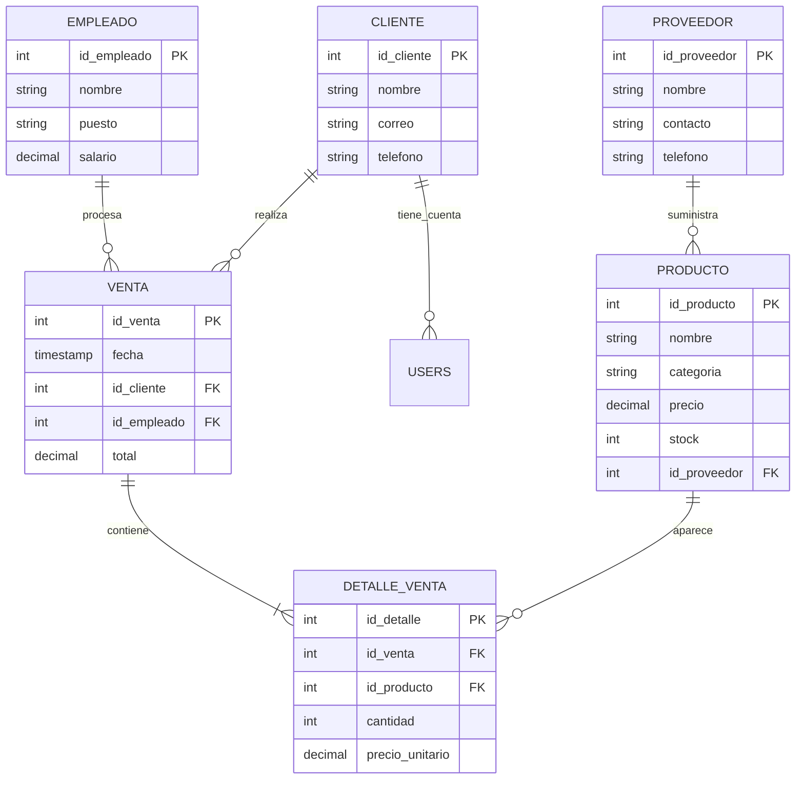

# Proyecto 2 - Bases de Datos 1 (Luxor)

Este proyecto es la entrega final del curso. Implementa un sistema de gestión de inventario y ventas para la perfumería "Luxor".

## Guía de Inicio Rápido

1. **Requisitos:** Tener instalado Docker y Docker Compose.
2. **Configuración de variables de entorno:**
   Crea un archivo `.env` en la raíz (puedes basarte en `.env.example`).
   Para que el proyecto sea evaluado, se deben utilizar las credenciales fijas:
   ```env
   POSTGRES_USER=proy3
   POSTGRES_PASSWORD=secret
   POSTGRES_DB=luxor_db
   POSTGRES_HOST=db
   POSTGRES_PORT=5432
   PORT=3000
   ```
3. **Ejecución (Desde cero):**
   ```bash
   docker compose down -v
   docker compose up -d --build
   ```
4. **Acceso:** [http://localhost:5173](http://localhost:5173)
5. **Cuentas de Prueba (Login):**
   - **Admin:** `admin@luxor.com` / `admin123`
   - **Manager:** `manager@luxor.com` / `manager123`
   - **Ventas:** `sales@luxor.com` / `sales123`
   - **Inventario:** `inventory@luxor.com` / `inv123`
   - **Cliente:** `client@luxor.com` / `client123`

---

## I. Esquema de Seguridad y Roles (Nivel Base de Datos)

Se definieron 5 roles dentro de PostgreSQL (`CREATE ROLE`) y se les asignaron permisos específicos mediante `GRANT` y `REVOKE` (ver `db/init.sql`). El ORM del backend ejecuta `SET LOCAL ROLE <rol>` al inicio de cada transacción para garantizar que las políticas se apliquen desde el motor de base de datos.

1. **`admin_role`**: Control total. 
   - Tablas accesibles: Todas. 
   - Operaciones: Todas (SELECT, INSERT, UPDATE, DELETE). Ejecución de todos los Stored Procedures.
2. **`manager_role`**: Gerencia y reportes.
   - Tablas accesibles: Lectura de todas las tablas.
   - Operaciones: `SELECT` global, `INSERT/UPDATE/DELETE` en `empleado`. Ejecución de Stored Procedures de reportería y eliminación de clientes.
3. **`sales_role`**: Operaciones de venta.
   - Tablas accesibles: `producto`, `cliente`, `empleado`, `proveedor`, `venta`, `detalle_venta`, y vistas de ventas.
   - Operaciones: `SELECT` en catálogo y clientes. `INSERT/UPDATE` en `venta`, `detalle_venta`, y `cliente`. Ejecución de `sp_create_sale` y `sp_delete_client`.
4. **`inventory_role`**: Gestión de productos.
   - Tablas accesibles: Lectura global.
   - Operaciones: `INSERT/UPDATE/DELETE` sobre `producto` y `proveedor`. Ejecución de `sp_add_product` y `sp_update_stock`.
5. **`basic_role`**: Usuario base / solo lectura.
   - Tablas accesibles: `producto`, `proveedor` y `vista_ventas_completas`.
   - Operaciones: Únicamente `SELECT`.

---

## II. Diseño de Base de Datos

### Diagrama Entidad-Relación (ER)



### Modelo Relacional (Esquema)

- **Proveedor** (**id_proveedor**, nombre, contacto, telefono)
- **Producto** (**id_producto**, nombre, categoria, precio, stock, *id_proveedor*)
- **Cliente** (**id_cliente**, nombre, correo, telefono)
- **Empleado** (**id_empleado**, nombre, puesto, salario)
- **Venta** (**id_venta**, fecha, *id_cliente*, *id_empleado*, total)
- **Detalle_Venta** (**id_detalle**, *id_venta*, *id_producto*, cantidad, precio_unitario)
- **Users** (**id**, name, email, password, role)

### Normalización (3FN)

1.  **1FN:** Todos los atributos son atómicos. Se eliminaron grupos repetitivos de productos en ventas creando la tabla `Detalle_Venta`.
2.  **2FN:** Se cumple 1FN y todos los atributos no clave dependen funcionalmente de la clave primaria completa. En `Producto`, el `nombre` y `precio` dependen únicamente de `id_producto`.
3.  **3FN:** Se cumple 2FN y no existen dependencias transitivas. Por ejemplo, la información del Proveedor no reside en la tabla Producto (lo que crearía una dependencia transitiva Producto -> Proveedor -> NombreProveedor), sino que se referencia mediante `id_proveedor`.

---

## III. SQL, ORM y Funcionalidades

### Consultas Implementadas y ORM
- **ORM Sequelize:** Se integró Sequelize para todas las operaciones CRUD estándar de la aplicación.
- **SQL Explícito:** Las consultas analíticas (Reportes) utilizan SQL puro inyectado a través del ORM para maximizar eficiencia (`sequelize.query`).
- **JOINs:** Visualización de Productos con su Proveedor y Reporte de Ventas detallado.
- **Subqueries:** `IN` (Filtro de productos vendidos) y `EXISTS` (Identificación de clientes activos).
- **Agregación:** `GROUP BY` y `HAVING` para análisis de precios promedio por categoría.
- **CTE:** Bloque `WITH` para calcular comisiones y ventas totales por empleado.

### Stored Procedures
Se implementaron 5 Stored Procedures ejecutados desde el backend:
1. `sp_create_sale`: Realiza una Venta manejando una **transacción explícita** (`BEGIN` / `COMMIT` / `ROLLBACK`). Recibe parámetros de entrada y devuelve un parámetro de salida (`OUT`).
2. `sp_add_product`: Agrega productos manejando parámetros de entrada.
3. `sp_update_stock`: Actualiza el stock con bloque de **manejo de excepciones** (evita stocks negativos).
4. `sp_delete_client`: Previene la eliminación de clientes con transacciones existentes.
5. `sp_get_employee_sales`: Obtiene el rendimiento de un empleado particular con parámetros `IN` y `OUT`.

---

## IV. Instrucciones Técnicas Adicionales
- El proyecto utiliza **React 19**, **Node.js 22** y **PostgreSQL 16**.
- El manejo de sesiones y autenticación se realiza mediante **JWT** (JSON Web Tokens) guardado en el LocalStorage y transmitido en los headers HTTP.
- Los reportes permiten exportación a formato **CSV**.
