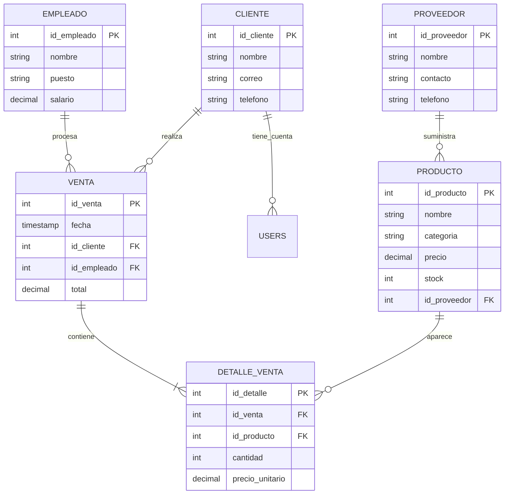

# Proyecto 2 - Bases de Datos 1 (Luxor)

Este proyecto es la entrega final del curso. Implementa un sistema de gestión de inventario y ventas para la perfumería "Luxor".

## Guía de Inicio Rápido

1. **Requisitos:** Tener instalado Docker y Docker Compose.
2. **Ejecución:**
   ```bash
   docker-compose up -d
   ```
3. **Acceso:** [http://localhost:5173](http://localhost:5173)
4. **Credenciales DB:** `proy2` / `secret` (Configuradas en `.env`).
5. **Credenciales App:** `admin@luxor.com` / `admin123`.

---

## I. Diseño de Base de Datos

### Diagrama Entidad-Relación (ER)



### Modelo Relacional (Esquema)

- **Proveedor** (**id_proveedor**, nombre, contacto, telefono)
- **Producto** (**id_producto**, nombre, categoria, precio, stock, *id_proveedor*)
- **Cliente** (**id_cliente**, nombre, correo, telefono)
- **Empleado** (**id_empleado**, nombre, puesto, salario)
- **Venta** (**id_venta**, fecha, *id_cliente*, *id_empleado*, total)
- **Detalle_Venta** (**id_detalle**, *id_venta*, *id_producto*, cantidad, precio_unitario)
- **Users** (**id**, name, email, password, role)

### Normalización (3FN)

1.  **1FN:** Todos los atributos son atómicos. Se eliminaron grupos repetitivos de productos en ventas creando la tabla `Detalle_Venta`.
2.  **2FN:** Se cumple 1FN y todos los atributos no clave dependen funcionalmente de la clave primaria completa. En `Producto`, el `nombre` y `precio` dependen únicamente de `id_producto`.
3.  **3FN:** Se cumple 2FN y no existen dependencias transitivas. Por ejemplo, la información del Proveedor no reside en la tabla Producto (lo que crearía una dependencia transitiva Producto -> Proveedor -> NombreProveedor), sino que se referencia mediante `id_proveedor`.

---

## II. SQL y Funcionalidades

### Consultas Implementadas
- **JOINs:** Visualización de Productos con su Proveedor y Reporte de Ventas detallado.
- **Subqueries:** 
    - `IN`: Filtro de productos con existencias en ventas.
    - `EXISTS`: Identificación de clientes con historial de compra.
- **Agregación:** `GROUP BY` y `HAVING` para análisis de precios promedio por categoría.
- **CTE:** Bloque `WITH` para calcular comisiones y ventas totales por empleado.
- **VIEW:** `vista_ventas_completas` para centralizar la lógica de reportes transaccionales.
- **Transacciones:** Proceso de Venta (`POST /sales`) que asegura la integridad entre la creación del registro, el detalle y la deducción de stock.

---

## III. Instrucciones Técnicas
- El proyecto utiliza **React 19**, **Node.js 22** y **PostgreSQL 16**.
- No se utilizan ORMs (Consultas en SQL puro).
- El manejo de sesiones se realiza mediante `AuthContext` en el frontend.
- Los reportes permiten exportación a formato **CSV**.
